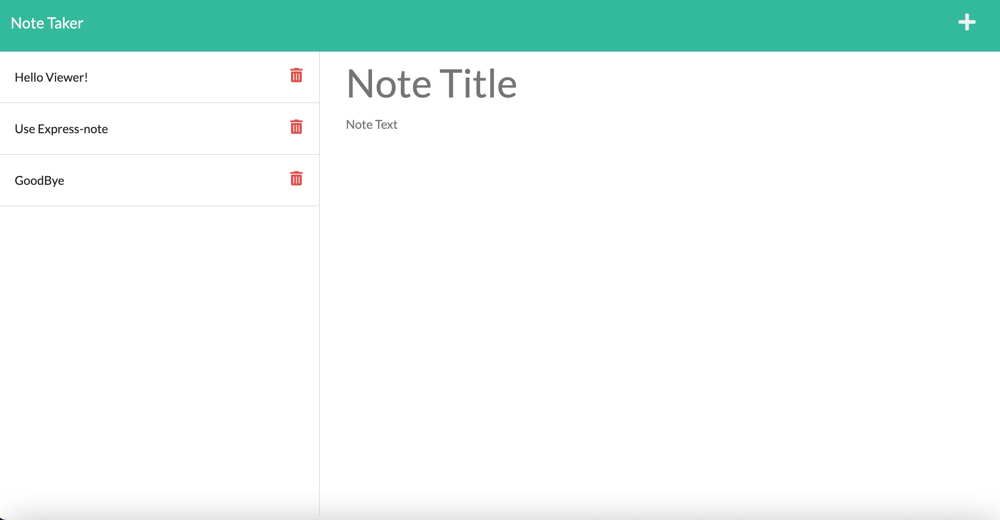

 [] 
# <h1 align="center">express-note</h1>

 
 
 

<a href="https://note-express.herokuapp.com/" alt="deployed heroku app">Link to Deployed Application</a>
 
 

## Description
A personal note-taking app that uses persistent storage with a simple JSON file and express.js.
  
## Table of Contents
  - [Description](#description)
  - [Installation](#installation)
  - [Usage](#usage)
  - [License](#license)
  - [Contributors](#contributors)
  - [Tests](#tests)
  - [Questions](#questions)

## Installation
1. Clone or Fork this repository
2. Install necessary packages
3. run `npm start` to open application @ `localhost:3001`
4. Add your own notes.

## Usage
A simple personal note-taking app. 

## License
[]This application is covered under the MIT license. (https://opensource.org/licenses/MIT)

## Contributors
- node.js (https://nodejs.org/en)
- express.js (https://expressjs.com/)
- Insomnia (https://insomnia.rest/)
- uuidV4 (https://www.npmjs.com/package/uuidv4)

## Tests
API testing done via Insomnia.

## Questions? Contact me:
GitHub: https://github.com/ejackson1228/  
Email: ejackson1228@gmail.com
